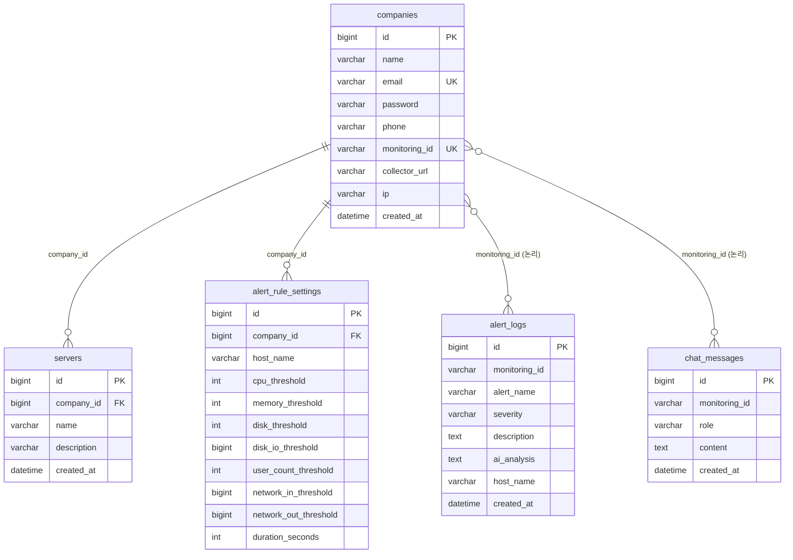

# Monittoring — ERD 문서

> 최종 업데이트: 2026-06-04  
> DB: MySQL 8.0 / Hibernate DDL-auto: update

---

## 엔티티 관계도 (텍스트 ERD)

```
companies (1) ──────────────── (N) servers
     │                               
     │ monitoringId                  
     │                               
     ├──── (N) alert_logs            
     │                               
     ├──── (N) alert_rule_settings   
     │                               
     └──── (N) chat_messages         
```

---

## 테이블 상세

### `companies`

| 컬럼          | 타입           | 제약                     | 설명                              |
|---------------|----------------|--------------------------|-----------------------------------|
| `id`          | BIGINT         | PK (수동 채번)           | 회사 ID                           |
| `name`        | VARCHAR(255)   | NOT NULL                 | 회사명                            |
| `email`       | VARCHAR(255)   | NOT NULL, UNIQUE         | 로그인용 이메일                   |
| `password`    | VARCHAR(255)   | NOT NULL                 | BCrypt 암호화 비밀번호            |
| `phone`       | VARCHAR(255)   | NOT NULL                 | 연락처                            |
| `monitoring_id` | VARCHAR(255) | NOT NULL, UNIQUE         | Prometheus 식별자 (mon-xxxxxxxx)  |
| `collector_url` | VARCHAR(255) | NOT NULL                 | OTel Collector ALB DNS            |
| `ip`          | VARCHAR(255)   | NULL                     | 모니터링 EC2 private IP           |
| `created_at`  | DATETIME       | NOT NULL                 | 등록 일시                         |

**관계:**
- `companies.id` → `servers.company_id` (1:N)
- `companies.monitoring_id` → `alert_logs.monitoring_id` (논리적 FK, 1:N)
- `companies.monitoring_id` → `chat_messages.monitoring_id` (논리적 FK, 1:N)
- `companies.id` → `alert_rule_settings.company_id` (1:N)

---

### `servers`

| 컬럼          | 타입           | 제약                     | 설명                              |
|---------------|----------------|--------------------------|-----------------------------------|
| `id`          | BIGINT         | PK, AUTO_INCREMENT       | 서버 ID                           |
| `company_id`  | BIGINT         | NOT NULL, INDEX          | 소속 회사 ID                      |
| `name`        | VARCHAR(255)   | NOT NULL                 | 서버 호스트명                     |
| `description` | VARCHAR(255)   | NULL                     | 서버 설명                         |
| `created_at`  | DATETIME       | NOT NULL                 | 등록 일시                         |

> Prometheus에서 수집되는 `host_name` 레이블과 매핑하여 등록 여부를 판별합니다.

---

### `alert_logs`

| 컬럼           | 타입           | 제약                     | 설명                              |
|----------------|----------------|--------------------------|-----------------------------------|
| `id`           | BIGINT         | PK, AUTO_INCREMENT       | 알림 로그 ID                      |
| `monitoring_id`| VARCHAR(255)   | NOT NULL, INDEX          | 소속 회사의 모니터링 ID           |
| `alert_name`   | VARCHAR(255)   | NOT NULL                 | Prometheus alert 이름             |
| `severity`     | VARCHAR(255)   | NOT NULL                 | critical / warning                |
| `description`  | TEXT           | NOT NULL                 | 알림 상세 내용                    |
| `ai_analysis`  | TEXT           | NULL                     | GPT 분석 결과                     |
| `host_name`    | VARCHAR(255)   | NULL                     | 발생 호스트 (멀티호스트 환경)     |
| `created_at`   | DATETIME       | NOT NULL                 | 알림 발생 일시                    |

---

### `alert_rule_settings`

| 컬럼                   | 타입    | 제약                              | 설명                              |
|------------------------|---------|-----------------------------------|-----------------------------------|
| `id`                   | BIGINT  | PK, AUTO_INCREMENT                | 설정 ID                           |
| `company_id`           | BIGINT  | NOT NULL                          | 소속 회사 ID                      |
| `host_name`            | VARCHAR | NULL                              | 호스트별 설정 (null = 전체 기본값)|
| `cpu_threshold`        | INT     | NOT NULL, DEFAULT 80              | CPU 임계값 (%)                    |
| `memory_threshold`     | INT     | NOT NULL, DEFAULT 85              | 메모리 임계값 (%)                 |
| `disk_threshold`       | INT     | NOT NULL, DEFAULT 90              | 디스크 임계값 (%)                 |
| `disk_io_threshold`    | BIGINT  | NOT NULL, DEFAULT 104857600       | 디스크 I/O 임계값 (bytes/s)       |
| `user_count_threshold` | INT     | NOT NULL, DEFAULT 10              | 동시 접속자 수 임계값             |
| `network_in_threshold` | BIGINT  | NOT NULL, DEFAULT 10485760        | 네트워크 수신 임계값 (bytes/s)    |
| `network_out_threshold`| BIGINT  | NOT NULL, DEFAULT 10485760        | 네트워크 송신 임계값 (bytes/s)    |
| `duration_seconds`     | INT     | NOT NULL, DEFAULT 10              | 알림 발동 지속 시간 (초)          |

**UNIQUE 제약:** `(company_id, host_name)` — 회사·호스트 조합별 1개 설정

---

### `chat_messages`

| 컬럼           | 타입           | 제약                     | 설명                              |
|----------------|----------------|--------------------------|-----------------------------------|
| `id`           | BIGINT         | PK, AUTO_INCREMENT       | 메시지 ID                         |
| `monitoring_id`| VARCHAR(255)   | NOT NULL, INDEX          | 소속 회사의 모니터링 ID           |
| `role`         | VARCHAR(255)   | NOT NULL                 | user / assistant                  |
| `content`      | TEXT           | NOT NULL                 | 대화 내용                         |
| `created_at`   | DATETIME       | NOT NULL                 | 생성 일시                         |

---

## 설계 특이사항

### 1. `companies.id` 수동 채번
- Hibernate `@GeneratedValue` 미사용
- `SELECT COALESCE(MAX(id), 0) + 1` 쿼리로 다음 ID 계산
- **이유:** ALB 리스너 룰 우선순위를 `id * 10`으로 자동 설정하기 위한 예측 가능한 ID 필요

### 2. `monitoring_id` 논리적 FK
- `alert_logs`, `chat_messages` → `companies`의 `monitoring_id` 참조
- **실제 DB FK 없음** — Prometheus AlertManager 웹훅에서 동적 라우팅되므로 느슨한 결합 유지

### 3. 호스트별 알림 규칙 (`alert_rule_settings`)
- `host_name = NULL`: 회사 전체 기본 임계값
- `host_name = 'web-01'`: 특정 호스트 개별 임계값
- 두 레코드가 공존 가능 — 조회 시 hostName 파라미터로 구분

### 4. 메트릭 데이터는 DB 비저장
- CPU·메모리·디스크·네트워크 시계열 데이터는 **Prometheus TSDB**에 저장
- 로그는 **Loki**에 저장
- Spring 백엔드는 조회 시 Prometheus/Loki REST API를 실시간 호출

---

## Mermaid ERD


